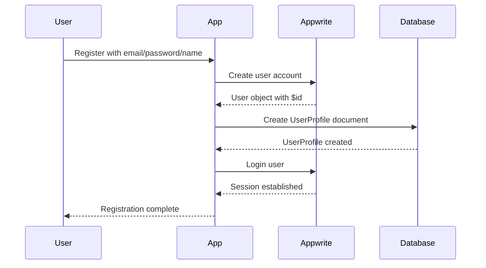
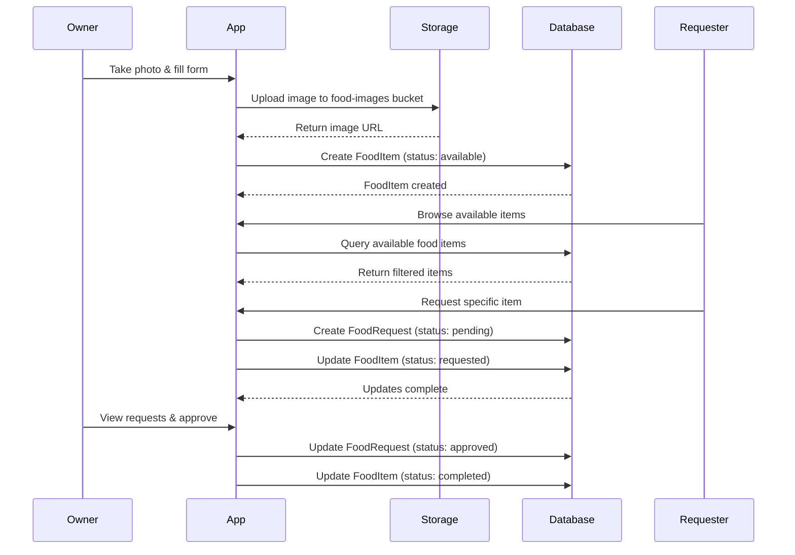
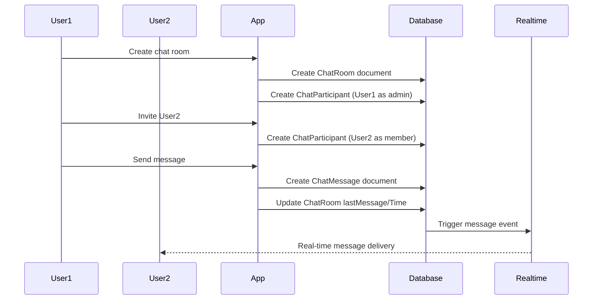
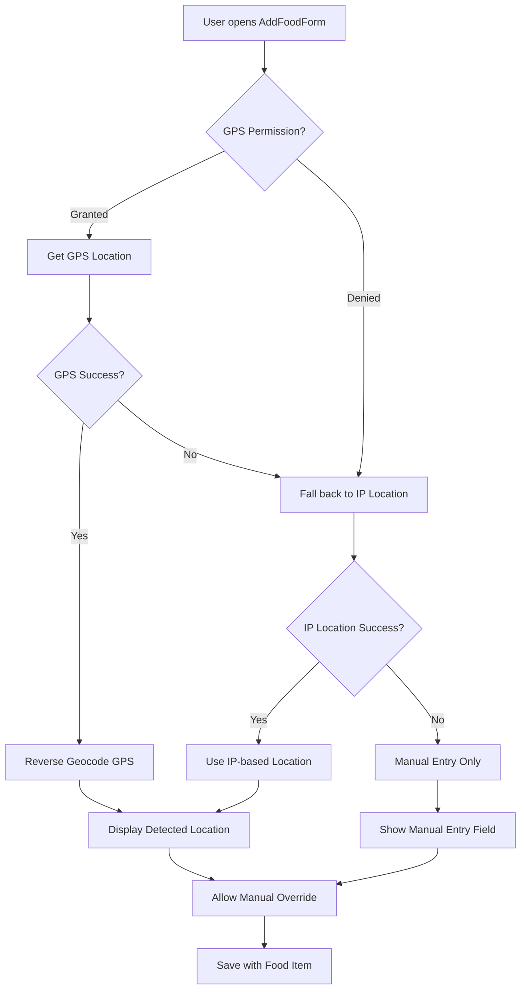

# Feest App - Complete Database Schema Documentation

This document provides comprehensive documentation of all database schemas, TypeScript interfaces, Appwrite collections, and data relationships in the Feest App.

## Table of Contents
- [Database Configuration](#database-configuration)
- [User Management](#user-management)
- [Food System](#food-system)
- [Chat System](#chat-system)
- [Notification System](#notification-system)
- [Location Services](#location-services)
- [Logging System](#logging-system)
- [Storage System](#storage-system)
- [Data Relationships](#data-relationships)
- [Database Indexes & Queries](#database-indexes--queries)
- [Security & Permissions](#security--permissions)
- [API Endpoints & Services](#api-endpoints--services)
- [Data Flow & Business Logic](#data-flow--business-logic)
- [Schema Evolution & Versioning](#schema-evolution--versioning)
- [Development Guidelines](#development-guidelines)
- [Testing Strategy](#testing-strategy)
- [Performance Monitoring](#performance-monitoring)

## Database Configuration

### Appwrite Configuration
- **Endpoint**: `https://syd.cloud.appwrite.io/v1`
- **Project ID**: `feest`
- **Platform**: `com.streetbyteid.feest`
- **Database ID**: `685060470025155bac52`

### Collection Overview
| Collection Name | Collection ID | Purpose |
|---|---|---|
| User Profiles | `user_profiles` | Extended user profile data |
| Food Items | `food-items` | Food sharing listings |
| Food Requests | `food-requests` | Requests for food items |
| Chat Rooms | `chat-rooms` | Chat room metadata |
| Chat Messages | `chat-messages` | Individual chat messages |
| Chat Participants | `chat-participants` | Room membership tracking |
| Food Swap Notifications | `food-swap-notifications` | Food request notifications |
| Notification History | `notification-history` | User notification history tracking |

### Storage Buckets
| Bucket Name | Bucket ID | Purpose |
|---|---|---|
| Food Images | `food-images` | User-uploaded food photos |

---

## User Management

### UserProfile Interface
**Collection ID**: `user_profiles`

```typescript
interface UserProfile {
  $id?: string;           // Appwrite document ID (auto-generated)
  userId: string;         // Reference to Appwrite User ID (unique)
  name: string;          // User's display name
  email: string;         // User's email address
  createdAt: Date;       // Account creation timestamp
  updatedAt: Date;       // Last profile update timestamp
}
```

**Validation Rules:**
- `userId`: Must be unique, references Appwrite User `$id`
- `name`: Required, 1-100 characters
- `email`: Required, valid email format
- `createdAt`, `updatedAt`: ISO 8601 date strings

### AuthContextType Interface
```typescript
interface AuthContextType {
  user: Models.User<Models.Preferences> | null;  // Appwrite User object
  userProfile: UserProfile | null;               // Extended user profile
  loading: boolean;                              // Authentication loading state
  login: (email: string, password: string) => Promise<void>;
  register: (email: string, password: string, name: string) => Promise<void>;
  logout: () => Promise<void>;
  error: string | null;                          // Authentication error messages
}
```

---

## Food System

### FoodItem Interface
**Collection ID**: `food-items`

```typescript
interface FoodItem {
  $id?: string;                    // Appwrite document ID (auto-generated)
  title: string;                   // Food item title/name
  description: string;             // Detailed description
  imageUri: string;               // URL to food image in storage
  expiryDate: Date;               // When the food expires
  status: 'available' | 'requested' | 'completed';  // Current status
  ownerId: string;                // Reference to UserProfile.$id
  ownerName: string;              // Cached owner name for performance
  location?: string;              // Optional pickup location (text)
  latitude?: number;              // GPS latitude coordinate
  longitude?: number;             // GPS longitude coordinate
  category?: string;              // Optional food category
  createdAt: Date;                // Creation timestamp
  updatedAt: Date;                // Last update timestamp
}
```

**Validation Rules:**
- `title`: Required, 1-100 characters
- `description`: Required, 1-1000 characters
- `imageUri`: Required, valid URL to uploaded image
- `expiryDate`: Required, must be future date for new items
- `status`: Required, one of the enum values
- `ownerId`: Required, must reference existing UserProfile
- `category`: Optional, one of predefined FoodCategory values

### FoodRequest Interface
**Collection ID**: `food-requests`

```typescript
interface FoodRequest {
  $id?: string;                    // Appwrite document ID (auto-generated)
  foodItemId: string;             // Reference to FoodItem.$id
  requesterId: string;            // Reference to UserProfile.$id
  requesterName: string;          // Cached requester name
  message?: string;               // Optional message from requester
  status: 'pending' | 'approved' | 'rejected';  // Request status
  createdAt: Date;                // Request creation timestamp
}
```

**Validation Rules:**
- `foodItemId`: Required, must reference existing FoodItem
- `requesterId`: Required, must reference existing UserProfile
- `requesterName`: Required, cached from user profile
- `message`: Optional, max 500 characters
- `status`: Required, defaults to 'pending'

### FoodCategory Type
```typescript
type FoodCategory = 
  | 'fruits'      // 🍎 Fresh fruits
  | 'vegetables'  // 🥕 Fresh vegetables
  | 'grains'      // 🌾 Bread, rice, pasta
  | 'dairy'       // 🥛 Milk, cheese, yogurt
  | 'meat'        // 🥩 Meat and fish
  | 'baked-goods' // 🍞 Baked items
  | 'prepared-meals'  // 🍽️ Ready-to-eat meals
  | 'beverages'   // 🥤 Drinks
  | 'other';      // 📦 Miscellaneous items
```---

## Chat System

### ChatRoom Interface
**Collection ID**: `chat-rooms`

```typescript
interface ChatRoom {
  $id?: string;                    // Appwrite document ID (auto-generated)
  name: string;                   // Room display name
  description?: string;           // Optional room description
  createdBy: string;              // Reference to UserProfile.$id (room owner)
  createdByName: string;          // Cached creator name
  participants: string[];         // Array of UserProfile.$id
  participantNames: string[];     // Cached participant names
  isPrivate: boolean;             // Whether room is private
  lastMessage?: string;           // Last message content (cached)
  lastMessageTime?: Date;         // Last message timestamp (cached)
  createdAt: Date;                // Room creation timestamp
  updatedAt: Date;                // Last room update timestamp
}
```

**Validation Rules:**
- `name`: Required, 1-100 characters
- `description`: Optional, max 500 characters
- `createdBy`: Required, must reference existing UserProfile
- `participants`: Array of valid UserProfile IDs
- `isPrivate`: Required boolean
- `lastMessage`: Auto-updated on new messages
- `lastMessageTime`: Auto-updated on new messages

### ChatMessage Interface
**Collection ID**: `chat-messages`

```typescript
interface ChatMessage {
  $id?: string;                    // Appwrite document ID (auto-generated)
  chatRoomId: string;             // Reference to ChatRoom.$id
  senderId: string;               // Reference to UserProfile.$id
  senderName: string;             // Cached sender name
  message: string;                // Message content
  messageType: 'text' | 'image' | 'system';  // Message type
  createdAt: Date;                // Message timestamp
}
```

**Validation Rules:**
- `chatRoomId`: Required, must reference existing ChatRoom
- `senderId`: Required, must reference existing UserProfile
- `senderName`: Required, cached from user profile
- `message`: Required, max 2000 characters for text, URL for images
- `messageType`: Required, defaults to 'text'

### ChatParticipant Interface
**Collection ID**: `chat-participants`

```typescript
interface ChatParticipant {
  $id?: string;                    // Appwrite document ID (auto-generated)
  chatRoomId: string;             // Reference to ChatRoom.$id
  userId: string;                 // Reference to UserProfile.$id
  userName: string;               // Cached user name
  joinedAt: Date;                 // When user joined the room
  role: 'admin' | 'member';       // Participant role
}
```

**Validation Rules:**
- `chatRoomId`: Required, must reference existing ChatRoom
- `userId`: Required, must reference existing UserProfile
- `userName`: Required, cached from user profile
- `joinedAt`: Required, set automatically on creation
- `role`: Required, defaults to 'member'

---

## Notification System

### FoodSwapNotification Interface
**Collection ID**: `food-swap-notifications`

```typescript
interface FoodSwapNotification {
  $id?: string;                    // Appwrite document ID (auto-generated)
  foodItemId: string;              // Reference to FoodItem.$id
  foodTitle: string;               // Cached food title for performance
  foodImageUri: string;            // Cached food image URL
  ownerId: string;                 // Food item owner's user ID
  ownerName: string;               // Cached owner name
  requesterId: string;             // User requesting the food
  requesterName: string;           // Cached requester name
  message?: string;                // Optional message from requester
  status: 'pending' | 'accepted' | 'rejected';  // Notification status
  type: 'food_request';            // Notification type
  read: boolean;                   // Read status
  acceptedAt?: Date;               // When request was accepted
  rejectedAt?: Date;               // When request was rejected
  transactionId?: string;          // Reference to Transaction.$id if accepted
  chatRoomId?: string;             // Reference to ChatRoom.$id if chat initiated
  createdAt: Date;                 // Notification creation timestamp
  updatedAt: Date;                 // Last update timestamp
}
```

**Validation Rules:**
- `foodItemId`: Required, must reference existing FoodItem
- `ownerId`: Required, must reference existing UserProfile
- `requesterId`: Required, must reference existing UserProfile
- `status`: Required, one of: 'pending', 'accepted', 'rejected'
- `type`: Required, currently only 'food_request'
- `read`: Required, defaults to false
- `createdAt`, `updatedAt`: ISO 8601 date strings

### NotificationHistory Interface
**Collection ID**: `notification-history`

```typescript
interface NotificationHistory {
  $id?: string;                    // Appwrite document ID (auto-generated)
  userId: string;                  // User this history belongs to
  notificationId: string;          // Reference to original notification
  type: 'food_request_sent' | 'food_request_received' | 'food_request_accepted' | 'food_request_rejected';
  title: string;                   // History entry title
  description: string;             // Detailed description
  relatedUserId: string;           // Other user involved in the interaction
  relatedUserName: string;         // Cached related user name
  foodItemId?: string;             // Reference to FoodItem.$id if applicable
  foodTitle?: string;              // Cached food title if applicable
  transactionId?: string;          // Reference to Transaction.$id if applicable
  read: boolean;                   // Read status
  createdAt: Date;                 // History entry creation timestamp
}
```

**Validation Rules:**
- `userId`: Required, must reference existing UserProfile
- `notificationId`: Required, must reference existing FoodSwapNotification
- `type`: Required, one of: 'food_request_sent', 'food_request_received', 'food_request_accepted', 'food_request_rejected'
- `title`: Required, 1-200 characters
- `description`: Required, 1-500 characters
- `relatedUserId`: Required, must reference existing UserProfile
- `read`: Required, defaults to false
- `createdAt`: ISO 8601 date string

### Type Definitions
```typescript
// Type aliases for better type safety
type NotificationType = FoodSwapNotification['type'];
type NotificationStatus = FoodSwapNotification['status'];
type HistoryType = NotificationHistory['type'];
```

### Notification Workflow
1. **Food Request Creation**: When a user requests food, a `FoodSwapNotification` is created for the owner
2. **Status Updates**: Owner can accept/reject, updating notification status
3. **History Tracking**: Each status change creates entries in `NotificationHistory`
4. **Transaction Creation**: Accepted requests trigger transaction creation
5. **Chat Initiation**: Optional chat room creation for communication

---

## Location Services

### LocationData Interface
```typescript
interface LocationData {
  latitude: number;               // GPS latitude coordinate
  longitude: number;              // GPS longitude coordinate
  city: string;                   // City name
  region: string;                 // State/region name
  country: string;                // Country name
  address: string;                // Formatted address string
  accuracy?: number;              // GPS accuracy in meters (optional)
  source?: 'gps' | 'ip';         // Location detection method
}
```

**Usage:**
- Used for food item location detection
- Supports both GPS and IP-based location
- Reverse geocoding for human-readable addresses
- Accuracy measurement for GPS locations

**Validation Rules:**
- `latitude`: Required, valid latitude (-90 to 90)
- `longitude`: Required, valid longitude (-180 to 180)
- `city`, `region`, `country`: Strings, can be empty if geocoding fails
- `address`: Required, formatted address or coordinates
- `accuracy`: Optional, positive number in meters
- `source`: Optional, indicates detection method

---

## Logging System

### Log Interface
```typescript
interface Log {
  date: Date;                     // Log timestamp
  status: number;                 // HTTP status code
  method: "GET" | "POST" | "DELETE" | "PUT" | "PATCH";  // HTTP method
  path: string;                   // API endpoint path
  response: string;               // Response data or error message
}
```

**Usage:**
- Client-side logging for debugging
- API request/response tracking
- Error monitoring and diagnostics

**Validation Rules:**
- `date`: Required, valid Date object
- `status`: Required, valid HTTP status code (100-599)
- `method`: Required, one of the supported HTTP methods
- `path`: Required, API endpoint path
- `response`: Required, string representation of response/error

---

## Storage System

### Storage Configuration
- **Storage Bucket ID**: `food-images`
- **Purpose**: Store food item images uploaded by users
- **File Types**: Images (JPEG, PNG, WebP)
- **Max File Size**: 10MB (Appwrite default)
- **Access**: Public read, authenticated write

### Image Upload Process
```typescript
// Image upload workflow
const uploadImage = async (imageUri: string, fileName: string): Promise<string> => {
  // 1. Validate user authentication
  // 2. Convert image URI to File object
  // 3. Upload to 'food-images' bucket
  // 4. Return public URL for storage in FoodItem.imageUri
  // 5. Handle upload errors and retry logic
}
```

**File Naming Convention:**
- Format: `food_{timestamp}.{extension}`
- Example: `food_1703123456789.jpg`
- Ensures unique filenames and chronological ordering

**Security:**
- Files are publicly readable for display
- Upload requires authentication
- File type validation on client and server
- Automatic cleanup of orphaned files (future enhancement)

---

## Data Relationships

### Entity Relationship Diagram
```
UserProfile (1) ──┐
                  │
                  ├─── (1:n) ──→ FoodItem
                  │
                  ├─── (1:n) ──→ FoodRequest  
                  │
                  ├─── (1:n) ──→ ChatRoom (as creator)
                  │
                  ├─── (m:n) ──→ ChatRoom (as participant)
                  │
                  ├─── (1:n) ──→ ChatMessage
                  │
                  └─── (1:n) ──→ ChatParticipant

FoodItem (1) ──── (1:n) ──→ FoodRequest

ChatRoom (1) ──┐
               ├─── (1:n) ──→ ChatMessage
               │
               └─── (1:n) ──→ ChatParticipant
```

### Detailed Relationships

#### User → Food Items
- **Relationship**: One-to-Many
- **Foreign Key**: `FoodItem.ownerId` → `UserProfile.$id`
- **Description**: Each user can create multiple food items
- **Constraints**: User can only modify their own food items

#### User → Food Requests
- **Relationship**: One-to-Many  
- **Foreign Key**: `FoodRequest.requesterId` → `UserProfile.$id`
- **Description**: Each user can make multiple food requests
- **Business Rules**: User cannot request their own food items

#### Food Item → Food Requests
- **Relationship**: One-to-Many
- **Foreign Key**: `FoodRequest.foodItemId` → `FoodItem.$id`
- **Description**: Each food item can have multiple requests
- **State Management**: Item status changes when requested/completed

#### User → Chat Rooms (Creator)
- **Relationship**: One-to-Many
- **Foreign Key**: `ChatRoom.createdBy` → `UserProfile.$id`
- **Description**: Each user can create multiple chat rooms
- **Permissions**: Creator has admin privileges

#### User → Chat Rooms (Participant)
- **Relationship**: Many-to-Many (via ChatParticipant)
- **Junction Table**: `ChatParticipant`
- **Description**: Users can participate in multiple rooms
- **Access Control**: Only participants can view room content

#### Chat Room → Messages
- **Relationship**: One-to-Many
- **Foreign Key**: `ChatMessage.chatRoomId` → `ChatRoom.$id`
- **Description**: Each room can have unlimited messages
- **Ordering**: Messages ordered by `createdAt` timestamp

#### Chat Room → Participants
- **Relationship**: One-to-Many
- **Foreign Key**: `ChatParticipant.chatRoomId` → `ChatRoom.$id`
- **Description**: Track room membership and roles
- **Role Management**: Admin/member permissions

---

## Database Indexes & Queries

### Recommended Indexes

#### user_profiles Collection
```javascript
// Primary indexes
{ "userId": 1 }         // Unique index for user lookup
{ "email": 1 }          // Unique index for email validation
{ "createdAt": -1 }     // Chronological ordering
```

#### food-items Collection
```javascript
// Performance indexes
{ "ownerId": 1, "status": 1 }           // User's items by status
{ "status": 1, "expiryDate": 1 }        // Available items by expiry
{ "category": 1, "status": 1 }          // Items by category
{ "latitude": 1, "longitude": 1 }       // Geospatial queries (future)
{ "createdAt": -1 }                     // Recent items first

// Compound indexes for efficient filtering
{ "status": 1, "expiryDate": 1, "createdAt": -1 }
```

#### food-requests Collection
```javascript
// Request tracking indexes
{ "foodItemId": 1, "status": 1 }        // Requests per item
{ "requesterId": 1, "status": 1 }       // User's requests
{ "createdAt": -1 }                     // Recent requests first
```

#### chat-rooms Collection
```javascript
// Chat room indexes
{ "createdBy": 1 }                      // Rooms created by user
{ "participants": 1 }                   // Rooms user participates in
{ "isPrivate": 1, "updatedAt": -1 }     // Public rooms by activity
{ "lastMessageTime": -1 }               // Most active rooms first
```

#### chat-messages Collection
```javascript
// Message retrieval indexes
{ "chatRoomId": 1, "createdAt": -1 }    // Room messages chronologically
{ "senderId": 1, "createdAt": -1 }      // User's messages
```

#### chat-participants Collection
```javascript
// Participation tracking
{ "chatRoomId": 1, "role": 1 }          // Room members by role
{ "userId": 1, "joinedAt": -1 }         // User's room history
```

### Common Query Patterns

#### Food System Queries
```typescript
// Get available food items
Query.equal('status', 'available')
Query.orderDesc('createdAt')

// Get user's food items
Query.equal('ownerId', userId)
Query.orderDesc('createdAt')

// Get expiring items (next 3 days)
Query.equal('status', 'available')
Query.lessThan('expiryDate', threeDaysFromNow)
Query.greaterThan('expiryDate', now)

// Get items by category
Query.equal('category', 'fruits')
Query.equal('status', 'available')

// Get food requests for item
Query.equal('foodItemId', itemId)
Query.orderDesc('createdAt')
```

#### Chat System Queries
```typescript
// Get user's chat rooms
Query.contains('participants', userId)
Query.orderDesc('lastMessageTime')

// Get public chat rooms
Query.equal('isPrivate', false)
Query.orderDesc('updatedAt')

// Get room messages (paginated)
Query.equal('chatRoomId', roomId)
Query.orderDesc('createdAt')
Query.limit(50)

// Get room participants
Query.equal('chatRoomId', roomId)
Query.orderAsc('joinedAt')
```

#### User System Queries
```typescript
// Get user profile by Appwrite user ID
Query.equal('userId', appwriteUserId)

// Search users by name (if implemented)
Query.search('name', searchTerm)
```

### Performance Optimization

#### Query Limits
- Default limit: 25 documents
- Maximum limit: 100 documents
- Use pagination for large datasets
- Implement cursor-based pagination for real-time data

#### Caching Strategy
- Cache frequently accessed data (user profiles, food categories)
- Use Appwrite's built-in caching
- Implement client-side caching for static data
- Cache geolocation results

#### Real-time Subscriptions
```typescript
// Subscribe to food item changes
client.subscribe('databases.{databaseId}.collections.food-items.documents', callback);

// Subscribe to chat messages
client.subscribe('databases.{databaseId}.collections.chat-messages.documents', callback);

// Subscribe to user's food requests
client.subscribe(`databases.{databaseId}.collections.food-requests.documents.{userId}`, callback);
```

---

## Security & Permissions

### Authentication Requirements
- All database operations require authenticated user
- User session managed through Appwrite Auth
- JWT tokens for API authorization
- Session persistence across app restarts

### Data Access Control

#### User Profile Access
- Users can read their own profile
- Users can update their own profile
- Public read access for cached names in other collections
- Admin users can read all profiles (if implemented)

#### Food Item Permissions
- **Create**: Authenticated users only
- **Read**: Public read access for discovery
- **Update**: Owner only (status, details)
- **Delete**: Owner only
- **Business Rule**: Cannot modify items with pending requests

#### Food Request Permissions
- **Create**: Authenticated users (except item owner)
- **Read**: Item owner and requester only
- **Update**: Item owner (approve/reject) and requester (message)
- **Delete**: Requester only (before approval)

#### Chat System Permissions
- **Chat Rooms**: 
  - Create: Authenticated users
  - Read: Participants only
  - Update: Room creator/admins only
  - Delete: Room creator only
- **Chat Messages**:
  - Create: Room participants only
  - Read: Room participants only
  - Update: Message sender (edit functionality)
  - Delete: Message sender or room admin
- **Chat Participants**:
  - Create: Room creator/admins only
  - Read: Room participants only
  - Update: Role changes by admins only
  - Delete: Self-leave or admin removal

### Data Validation

#### Server-Side Validation
```typescript
// User profile validation
const validateUserProfile = {
  userId: { required: true, type: 'string', unique: true },
  name: { required: true, type: 'string', minLength: 1, maxLength: 100 },
  email: { required: true, type: 'email', unique: true }
};

// Food item validation
const validateFoodItem = {
  title: { required: true, type: 'string', minLength: 1, maxLength: 100 },
  description: { required: true, type: 'string', minLength: 1, maxLength: 1000 },
  imageUri: { required: true, type: 'url' },
  expiryDate: { required: true, type: 'datetime', futureOnly: true },
  status: { required: true, enum: ['available', 'requested', 'completed'] }
};

// Chat message validation
const validateChatMessage = {
  message: { required: true, type: 'string', minLength: 1, maxLength: 2000 },
  messageType: { required: true, enum: ['text', 'image', 'system'] },
  chatRoomId: { required: true, type: 'string', exists: 'chat-rooms' }
};
```

#### Client-Side Validation
- Form validation before submission
- Image file type and size validation
- Date validation for expiry dates
- Real-time validation feedback

### Privacy Considerations

#### Personal Information
- Minimal personal data collection
- Email used only for authentication
- Location data is optional and user-controlled
- No sensitive financial information stored

#### Data Anonymization
- Option to use display names instead of real names
- Location can be approximate (city level)
- Message history can be cleared by users
- Account deletion removes all associated data

#### GDPR Compliance
- Right to access personal data
- Right to rectification of incorrect data
- Right to erasure (account deletion)
- Right to data portability
- Consent management for location services

---

## API Endpoints & Services

### Service Architecture

#### AuthService (contexts/AuthContext.tsx)
```typescript
class AuthService {
  // Authentication operations
  login(email: string, password: string): Promise<void>
  register(email: string, password: string, name: string): Promise<void>
  logout(): Promise<void>
  checkUser(): Promise<void>
  
  // Profile management
  fetchUserProfile(userId: string): Promise<UserProfile>
  createUserProfile(userId: string, email: string, name: string): Promise<void>
}
```

#### FoodService (services/foodService.ts)
```typescript
class FoodService {
  // Food item operations
  static createFoodItem(foodData: Omit<FoodItem, '$id' | 'createdAt' | 'updatedAt'>): Promise<FoodItem>
  static getFoodItems(status?: string): Promise<FoodItem[]>
  static getUserFoodItems(userId: string): Promise<FoodItem[]>
  static updateFoodItemStatus(foodId: string, status: FoodItem['status']): Promise<void>
  static deleteFoodItem(foodId: string): Promise<void>
  
  // Image management
  static uploadFoodImage(imageUri: string, fileName: string): Promise<string>
  
  // Request management
  static createFoodRequest(requestData: Omit<FoodRequest, '$id' | 'createdAt'>): Promise<FoodRequest>
  static getFoodRequests(foodItemId: string): Promise<FoodRequest[]>
  static updateRequestStatus(requestId: string, status: FoodRequest['status']): Promise<void>
  
  // Utility functions
  static isOwner(foodId: string): Promise<boolean>
  static ensureUserPermissions(): Promise<void>
  static ensureAuthenticated(): Promise<void>
}
```

#### ChatService (services/chatService.ts)
```typescript
class ChatService {
  // Room management
  static createChatRoom(name: string, description: string, isPrivate: boolean, participants: string[]): Promise<ChatRoom>
  static getChatRooms(userId: string): Promise<ChatRoom[]>
  static joinChatRoom(roomId: string, userId: string): Promise<void>
  static leaveChatRoom(roomId: string, userId: string): Promise<void>
  
  // Message operations
  static sendMessage(roomId: string, message: string, messageType: string): Promise<ChatMessage>
  static getMessages(roomId: string, limit: number): Promise<ChatMessage[]>
  static deleteMessage(messageId: string): Promise<void>
  
  // Participant management
  static addParticipant(roomId: string, userId: string, role: string): Promise<ChatParticipant>
  static removeParticipant(roomId: string, userId: string): Promise<void>
  static updateParticipantRole(participantId: string, role: string): Promise<void>
}
```

#### LocationService (services/locationService.ts)
```typescript
class LocationService {
  // Location detection
  static getDeviceLocation(): Promise<LocationData | null>
  static getLocationFromIP(): Promise<LocationData | null>
  static getLocationAuto(): Promise<LocationData | null>
  
  // Utility functions
  static isLocationEnabled(): Promise<boolean>
  static formatCoordinates(lat: number, lng: number): string
  static calculateDistance(loc1: LocationData, loc2: LocationData): number
}
```

#### NotificationService (services/notificationService.ts)
```typescript
class NotificationService {
  // Notification operations
  static createFoodSwapNotification(notificationData: Omit<FoodSwapNotification, '$id' | 'createdAt' | 'updatedAt'>): Promise<FoodSwapNotification>
  static getUserNotifications(userId: string): Promise<FoodSwapNotification[]>
  static updateNotificationStatus(notificationId: string, status: FoodSwapNotification['status']): Promise<void>
  static deleteNotification(notificationId: string): Promise<void>
  
  // Utility functions
  static markAsRead(notificationId: string): Promise<void>
  static fetchNotificationHistory(userId: string): Promise<NotificationHistory[]>
}
```

### Error Handling

#### Common Error Types
```typescript
// Authentication errors
AuthenticationError: 'User not authenticated'
AuthorizationError: 'User not authorized for this action'

// Validation errors
ValidationError: 'Invalid input data'
RequiredFieldError: 'Required field missing'

// Business logic errors
BusinessRuleError: 'Cannot request own food item'
StatusError: 'Invalid status transition'

// Network errors
NetworkError: 'Network request failed'
TimeoutError: 'Request timeout'

// Storage errors
StorageError: 'File upload failed'
FileSizeError: 'File too large'
```

#### Error Response Format
```typescript
interface ErrorResponse {
  error: {
    code: string;           // Error code for programmatic handling
    message: string;        // Human-readable error message
    details?: any;          // Additional error context
    timestamp: Date;        // When the error occurred
  }
}
```

### API Rate Limiting

#### Appwrite Default Limits
- **Requests per minute**: 60 (authenticated users)
- **Requests per minute**: 10 (anonymous users)
- **File uploads**: 10MB max size
- **Database operations**: 100 documents per request

#### Client-Side Rate Limiting
- Implement exponential backoff for retries
- Queue requests during high-frequency operations
- Cache frequently accessed data
- Debounce user input for search/filter operations

---

## Data Flow & Business Logic

### User Registration & Authentication Flow


### Food Sharing Workflow


### Chat System Flow


### Location Detection Flow


---

## Schema Evolution & Versioning

### Current Schema Version: 1.0

#### Version History
- **v1.0** (Initial Release): Base schemas for user management, food sharing, and chat system

#### Migration Strategy
```typescript
interface SchemaVersion {
  version: string;
  appliedAt: Date;
  migrations: Migration[];
}

interface Migration {
  id: string;
  description: string;
  up: () => Promise<void>;
  down: () => Promise<void>;
}
```

### Future Schema Enhancements

#### Planned v1.1 Features
- **User Ratings System**
  ```typescript
  interface UserRating {
    $id?: string;
    raterId: string;      // Who gave the rating
    ratedUserId: string;  // Who was rated
    rating: number;       // 1-5 stars
    comment?: string;     // Optional feedback
    transactionId: string; // Related food transaction
    createdAt: Date;
  }
  ```

- **Food Item Tags**
  ```typescript
  interface FoodTag {
    $id?: string;
    name: string;         // "vegetarian", "gluten-free", etc.
    category: string;     // "dietary", "cuisine", etc.
    color?: string;       // UI color for tag
  }
  
  // Add to FoodItem interface
  interface FoodItem {
    // ...existing fields...
    tags?: string[];      // Array of FoodTag.$id
  }
  ```

- **Notification System**
  ```typescript
  interface FoodSwapNotification {
    $id?: string;                    // Appwrite document ID (auto-generated)
    foodItemId: string;              // Reference to FoodItem.$id
    foodTitle: string;               // Cached food title for performance
    foodImageUri: string;            // Cached food image URL
    ownerId: string;                 // Food item owner's user ID
    ownerName: string;               // Cached owner name
    requesterId: string;             // User requesting the food
    requesterName: string;           // Cached requester name
    message?: string;                // Optional message from requester
    status: 'pending' | 'accepted' | 'rejected';  // Notification status
    type: 'food_request';            // Notification type
    read: boolean;                   // Read status
    acceptedAt?: Date;               // When request was accepted
    rejectedAt?: Date;               // When request was rejected
    transactionId?: string;          // Reference to Transaction.$id if accepted
    chatRoomId?: string;             // Reference to ChatRoom.$id if chat initiated
    createdAt: Date;                 // Notification creation timestamp
    updatedAt: Date;                 // Last update timestamp
  }

  interface NotificationHistory {
    $id?: string;                    // Appwrite document ID (auto-generated)
    userId: string;                  // User this history belongs to
    notificationId: string;          // Reference to original notification
    type: 'food_request_sent' | 'food_request_received' | 'food_request_accepted' | 'food_request_rejected';
    title: string;                   // History entry title
    description: string;             // Detailed description
    relatedUserId: string;           // Other user involved in the interaction
    relatedUserName: string;         // Cached related user name
    foodItemId?: string;             // Reference to FoodItem.$id if applicable
    foodTitle?: string;              // Cached food title if applicable
    transactionId?: string;          // Reference to Transaction.$id if applicable
    read: boolean;                   // Read status
    createdAt: Date;                 // History entry creation timestamp
  }

  // Type aliases for better type safety#### Planned v1.2 Features
- **Community Features**
  ```typescript
  interface Community {
    $id?: string;
    name: string;
    description: string;
    location: string;
    memberIds: string[];
    adminIds: string[];
    isPublic: boolean;
    createdAt: Date;
  }
  ```

- **Food Events**
  ```typescript
  interface FoodEvent {
    $id?: string;
    title: string;
    description: string;
    organizerId: string;
    location: string;
    eventDate: Date;
    maxParticipants?: number;
    participantIds: string[];
    status: 'upcoming' | 'ongoing' | 'completed' | 'cancelled';
    createdAt: Date;
  }
  ```

### Backward Compatibility

#### Breaking Changes Protocol
1. **Version Increment**: Major version for breaking changes
2. **Migration Scripts**: Automated data transformation
3. **Fallback Support**: Support previous schema version during transition
4. **User Communication**: In-app notifications about updates

#### Non-Breaking Changes
- Adding optional fields
- Adding new collections
- Adding indexes
- Expanding enum values

---

## Development Guidelines

### Code Organization
```
services/
├── authService.ts      # Authentication & user management
├── foodService.ts      # Food sharing operations
├── chatService.ts      # Chat system operations
├── locationService.ts  # Location detection & geocoding
└── notificationService.ts  # Push notifications (future)

types/
├── auth.ts            # Authentication types
├── food.ts            # Food system types  
├── chat.ts            # Chat system types
├── location.ts        # Location types
└── common.ts          # Shared types

contexts/
├── AuthContext.tsx    # Authentication state
├── FoodContext.tsx    # Food items state (future)
└── ChatContext.tsx    # Chat state (future)
```

### Naming Conventions

#### Collections
- Use kebab-case: `food-items`, `chat-messages`
- Descriptive and plural: `user_profiles`, `food-requests`

#### Fields
- Use camelCase: `createdAt`, `lastMessageTime`
- Boolean fields: prefix with `is` or `has`: `isPrivate`, `hasExpired`
- Reference fields: suffix with `Id`: `ownerId`, `chatRoomId`

#### Constants
- Use UPPER_SNAKE_CASE: `DATABASE_ID`, `FOOD_COLLECTION_ID`
- Group related constants: `COLLECTION_IDS`, `STORAGE_BUCKETS`

### Testing Strategy

#### Unit Tests
- Test each service method independently
- Mock Appwrite dependencies
- Validate input/output schemas
- Test error handling

#### Integration Tests
- Test complete user workflows
- Test data relationships
- Test authentication flows
- Test file upload processes

#### Schema Validation Tests
```typescript
describe('Schema Validation', () => {
  test('FoodItem schema validation', () => {
    const validFoodItem = {
      title: 'Fresh Apples',
      description: 'Organic apples from local farm',
      imageUri: 'https://example.com/image.jpg',
      expiryDate: new Date('2024-12-31'),
      status: 'available',
      ownerId: 'user123',
      ownerName: 'John Doe'
    };
    
    expect(validateFoodItem(validFoodItem)).toBe(true);
  });
});
```

---

## Performance Monitoring

### Key Metrics
- **Database Query Performance**: Response times per collection
- **File Upload Success Rate**: Image upload completion percentage
- **Real-time Message Delivery**: Chat message latency
- **Location Detection Accuracy**: GPS vs IP location success rates

### Monitoring Tools
- Appwrite built-in analytics
- Client-side performance logging
- Error tracking and reporting
- User experience metrics

### Optimization Strategies
- Implement database query optimization
- Use connection pooling for high-traffic
- Implement client-side caching
- Optimize image compression and storage
- Use CDN for static assets

---

*This documentation is maintained as a living document and should be updated with any schema changes or new features.*
